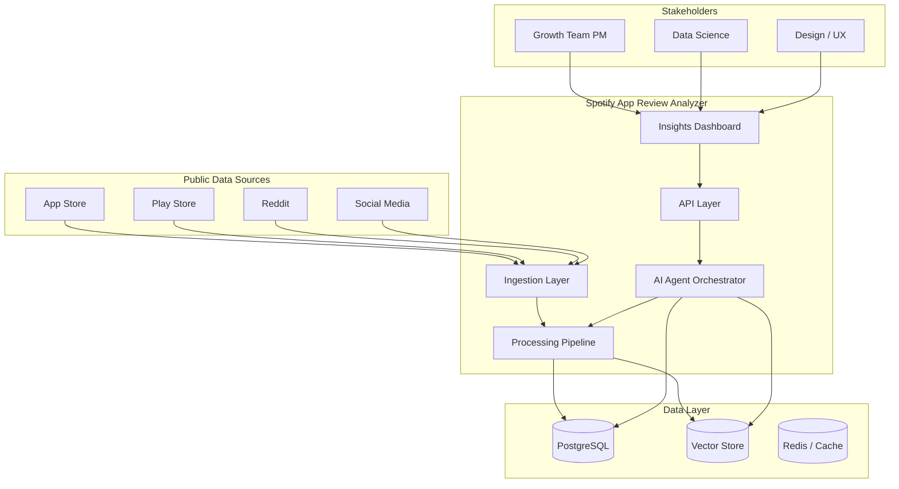
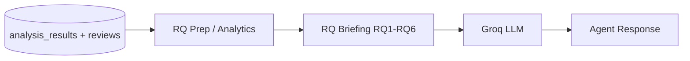
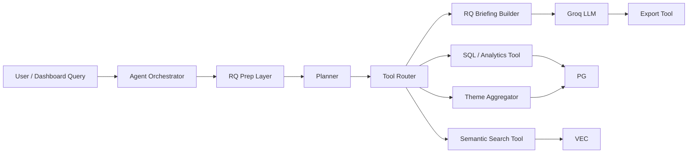
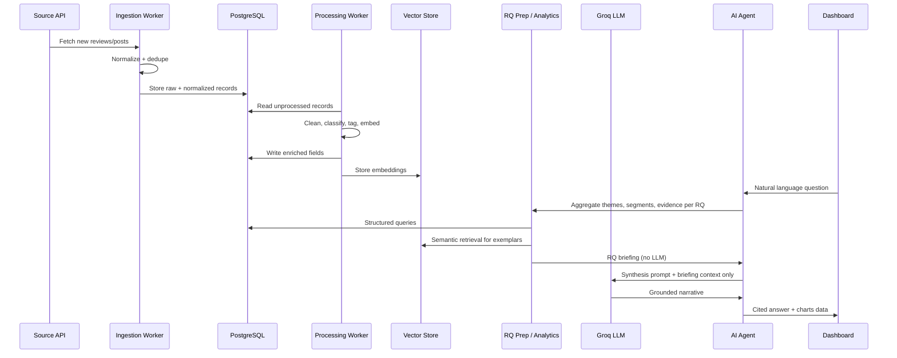
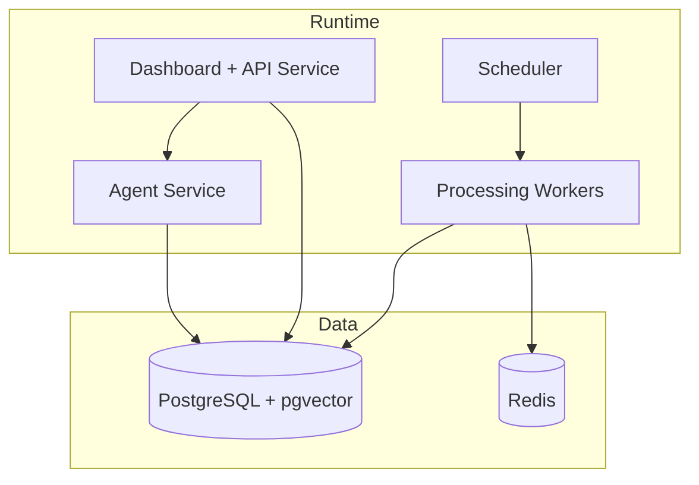

# Architecture: Spotify App Review Analyzer AI Agent

## Overview

The Spotify App Review Analyzer is an **AI agent system** that ingests public user feedback from app stores, Reddit, and social media; enriches it with NLP and LLM-based analysis; and surfaces structured insights through an agent interface and dashboard. The architecture is designed for phased delivery: each phase adds a capability layer without requiring a full rewrite of prior work.

See also: [problemstatement.md](./problemstatement.md) · [implementationplan.md](./implementationplan.md) · [decision.md](./decision.md)

---

## System Context

---

## High-Level Components

| Component | Responsibility | Phase Introduced |
|-----------|----------------|------------------|
| **Ingestion Layer** | Fetch, normalize, deduplicate, and persist raw reviews/posts | Phase 2 |
| **Processing Pipeline** | Clean text, score quality, run sentiment/theme/segment tagging | Phase 3 |
| **Taxonomy & Schema** | Canonical data model and discovery-theme vocabulary | Phase 1 |
| **AI Agent Orchestrator** | Tool-using agent; Groq-backed synthesis over pre-built RQ briefings | Phase 4 |
| **RQ Prep / Analytics Layer** | Deterministic RQ1–RQ6 aggregation and evidence packs before LLM | Phase 4 |
| **Retrieval Layer** | Semantic search over reviews and derived insights | Phase 4 |
| **API Layer** | REST/GraphQL endpoints for dashboard and programmatic access | Phase 5 |
| **Insights Dashboard** | Filters, charts, theme breakdowns, exports | Phase 5 |
| **Scheduler & Jobs** | Periodic ingestion, re-analysis, eval runs | Phase 2+ |
| **Observability** | Logging, metrics, eval tracking, cost monitoring | Phase 1+ |

---

## AI Agent Design

The agent is the **intelligent interface** on top of structured and unstructured review data. It does not replace the batch pipeline; it **queries, synthesizes, and explains** what the pipeline has stored.

**Phase 4 LLM:** [Groq](https://groq.com/) (fast inference API) for synthesis, summarization, and research-question Q&A. The agent never sends raw review corpora to Groq. It sends **pre-analyzed, grounded evidence packs** built from Phase 3 outputs.

### Pre-LLM Research Question Analysis (RQ Prep)

Before any Groq call, the system runs a **deterministic analytics pass** over `analysis_results`, `reviews`, and embeddings to build a clear picture of RQ1–RQ6:

| Step | What it does | Output |
|------|----------------|--------|
| **RQ aggregation** | Roll up theme counts, sentiment, source mix per RQ | Per-RQ metrics table |
| **Evidence selection** | Pick top-N exemplar reviews per theme (diverse sources) | Cited snippets with `review_id` |
| **Segment breakdown** | Compare iOS/Android, free/premium, tenure where tagged | Segment contrast tables |
| **Cross-source check** | Flag themes appearing in ≥2 channel types | Confidence boosters |
| **Gap analysis** | Identify thin evidence, low confidence, or conflicting signals | RQ readiness score |

This **RQ briefing** is generated locally (SQL + TF-IDF retrieval; no LLM cost) and serves two purposes:

1. **PM/stakeholder clarity** — Review structured RQ1–RQ6 findings before agent Q&A
2. **Groq context** — Agent prompts include only the briefing + selected evidence, not full DB dumps

### Agent Capabilities

1. **Research Q&A** — Answer the six discovery research questions with citations to source reviews
2. **Trend synthesis** — Summarize theme/sentiment shifts over a time window
3. **Segment comparison** — Contrast pain points across platform, tier, or tenure (where inferable)
4. **Cross-source validation** — Highlight themes that appear in multiple channels
5. **Report generation** — Produce stakeholder-ready summaries for roadmap discussions

### Agent Architecture

### Agent Tools (Planned)

| Tool | Input | Output |
|------|-------|--------|
| `search_reviews` | Query, filters (source, date, rating) | Ranked review snippets with metadata |
| `aggregate_themes` | Theme, time range, segment | Counts, sentiment distribution, top phrases |
| `compare_segments` | Segment A vs B, theme | Side-by-side metrics and exemplar quotes |
| `detect_cross_source_themes` | Theme or keyword | Presence across App Store, Play Store, Reddit, social |
| `build_rq_briefing` | RQ1–RQ6 or single RQ, filters | Structured evidence pack (metrics + citations) — **runs before Groq** |
| `summarize_research_question` | RQ1–RQ6, filters | Groq narrative summary grounded in `build_rq_briefing` output |
| `export_insights` | Report spec | CSV / PDF / Markdown artifact |

### Agent Guardrails

- **Analyze before generate**: Always run `build_rq_briefing` (or equivalent tools) before Groq synthesis
- **Grounding**: Responses must cite source records from the briefing; no unsupported claims
- **Confidence scoring**: Low-confidence classifications flagged in output
- **Token budget**: Send only top-N exemplars per theme to Groq (configurable cap)
- **PII redaction**: Strip or mask emails, phone numbers, handles where policy requires
- **Cost controls**: Cache RQ briefings; Groq calls only for synthesis, not bulk classification
- **Human-in-the-loop**: PM reviews RQ briefing before trusting agent narratives

---

## Data Flow

---

## Data Model (Core Entities)

### `sources`
Platform identifier: `app_store`, `play_store`, `reddit`, `twitter`, `tiktok`, `instagram`, `youtube`, `facebook`.

### `reviews` (normalized content unit)
| Field | Description |
|-------|-------------|
| `id` | Internal UUID |
| `source_id` | FK to sources |
| `external_id` | Platform-native ID |
| `text` | Review/post body |
| `title` | Optional (Reddit, YouTube) |
| `rating` | Star rating if applicable |
| `author_hash` | Pseudonymized author ID |
| `published_at` | Source timestamp |
| `app_version` | If available |
| `metadata` | JSON: device, locale, engagement metrics |
| `content_hash` | Dedup key |
| `processing_status` | `pending`, `processed`, `failed`, `skipped` |

### `analysis_results`
| Field | Description |
|-------|-------------|
| `review_id` | FK |
| `sentiment` | `positive`, `neutral`, `negative`, `mixed` |
| `sentiment_score` | Float |
| `themes` | Array of taxonomy theme IDs |
| `research_questions` | Mapped RQ1–RQ6 tags |
| `listening_intent` | Inferred behavior tags |
| `segment_tags` | Inferred: platform, tier, tenure, etc. |
| `confidence` | Model confidence |
| `model_version` | For reproducibility |

### `theme_taxonomy`
Hierarchical themes aligned to research questions (e.g., `rq2.recommendations.repetition`).

### `agent_queries` / `agent_responses`
Audit log of agent interactions for eval and improvement.

---

## Technology Stack (Proposed)

| Layer | Technology | Rationale |
|-------|------------|-----------|
| Language | Python 3.11+ | Ecosystem for NLP, agents, data pipelines |
| Agent framework | LangGraph or equivalent | Stateful tool-calling workflows |
| LLM (Phase 4) | **Groq API** (e.g. `llama-3.3-70b-versatile`) | Fast inference; synthesis and RQ Q&A only |
| Pre-LLM analytics | SQL + Phase 3 tags + TF-IDF retrieval | RQ briefing without token cost |
| Embeddings (Phase 3) | TF-IDF (local); optional upgrade later | Semantic search for evidence selection |
| API | FastAPI | Lightweight, async, OpenAPI docs |
| Database | PostgreSQL / SQLite (local) | Relational queries, JSON metadata |
| Vector store | TF-IDF index (`data/models/`) or pgvector at scale | Evidence retrieval for RQ prep |
| Job scheduler | APScheduler / Celery + Redis | Ingestion and batch processing |
| Dashboard | Streamlit (MVP) → React (scale) | Fast iteration, then polish |
| Infra | Docker, optional Render/cloud | See Render skills if deploying |

Final stack choices are recorded in [decision.md](./decision.md) as they are made.

---

## Processing Pipeline Stages

1. **Ingest** — Pull from source APIs/scrapers within ToS limits
2. **Normalize** — Map to canonical schema
3. **Dedupe** — `content_hash` + fuzzy matching for near-duplicates
4. **Filter** — Drop spam, off-topic, non-English (configurable)
5. **Enrich** — Sentiment, theme classification, segment inference
6. **Embed** — Vectorize for retrieval
7. **Aggregate** — Roll up daily/weekly metrics by theme, source, segment
8. **Index** — Expose to agent tools and dashboard

---

## Security & Compliance

- Store only **public** data; respect platform Terms of Service and rate limits
- API keys and secrets in environment variables / secret manager
- No storage of credentials for private communities
- Pseudonymize author identifiers; avoid retaining PII beyond policy
- Audit log for agent queries and exports

---

## Scalability Considerations

| Concern | Approach |
|---------|----------|
| Volume growth | Batch processing with backpressure; partition by source |
| LLM cost | Phase 3 rule-based tagging (no LLM); Groq only for synthesis; cache RQ briefings |
| Query latency | Pre-computed RQ rollups; Groq receives compact evidence packs |
| Multi-source drift | Source-specific adapters behind a common `IngestionProvider` interface |

---

## Deployment Topology (Target State)

---

## Phase-to-Architecture Mapping

| Phase | Architecture Deliverable |
|-------|--------------------------|
| 1 | Repo structure, schema, taxonomy, observability baseline |
| 2 | Ingestion adapters (App Store, Play Store, Reddit) |
| 3 | Processing pipeline + batch classification |
| 4 | RQ prep analytics + Groq agent + retrieval + research-question tools |
| 5 | Social ingestion + trend/burst detection |
| 6 | Dashboard + API + exports |
| 7 | Production hardening, eval automation, continuous improvement |

Phase details and timelines: [implementationplan.md](./implementationplan.md)  
Per-phase exit criteria: [phases/](./phases/)
